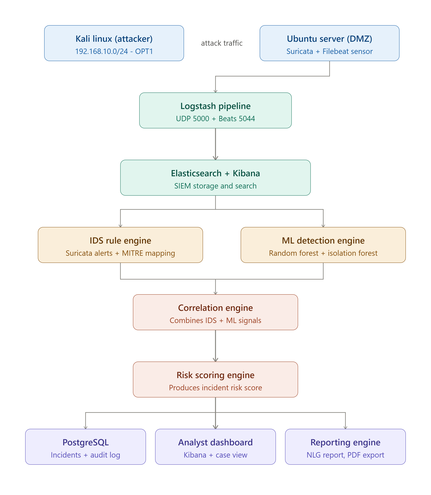

# SENTRA - SOC Platform Prototype 

Prototype de plateforme SOC combinant détection d'intrusion (Suricata), machine learning (Random Forest / Isolation Forest), corrélation d'alertes, scoring de risque et gestion d'incidents.

## Architecture & Réseaux


- Attaquant (Kali Linux) : 192.168.10.0/24
- Cible / DMZ (Ubuntu Server) : 192.168.20.0/24
- SOC (Ubuntu + Docker) : 192.168.30.0/24
- Routeur / Pare-feu (pfSense) : Configuration WAN en NAT pour isoler le laboratoire de l'extérieur.


## Stack Technique
- Infrastructure Lab : pfSense, Kali Linux, Ubuntu Server, Ubuntu SOC (VMware Workstation).
- Pipeline d'Ingestion : Filebeat, Suricata (syslog-ng), Logstash.
- SIEM : Elasticsearch, Kibana.
- Machine Learning : scikit-learn (Random Forest, Isolation Forest), dataset CICIDS2017.
- Backend & APIs : FastAPI (correlation-engine, risk-scoring-engine, reporting-engine, case-management-api).
- Persistance des Données : PostgreSQL.

## Démarrage rapide
Prérequis : Docker + Docker Compose sur la VM SOC, fichier .env configuré.
```bash
git clone <url-du-repo>
cd SENTRA
cp .env.example .env   # À compléter avec vos identifiants (SMTP, Webhook)
./setup.sh
```

## Structure du Projet

```text
SENTRA/
├── docker-compose.yml                 # ELK + backend + postgres
├── setup.sh                           # Script d'initialisation
├── docs/                              # Architecture, ADRs, rapports
├── lab/                               # Configurations pfSense et réseau
├── ingestion/                         # Pipelines Logstash et règles Suricata
├── ml/                                # Notebooks, modèles .pkl et datasets
├── correlation-engine/                # Service Python d'analyse
├── risk-scoring-engine/               # Moteur d'évaluation hybride
├── backend-api/                       # API interne de détection ML
├── case-management-api/               # Gestion des incidents et notifications
├── database/                          # Schémas PostgreSQL et migrations
└── scripts/                           # Scénarios de rejeu d'attaques
```